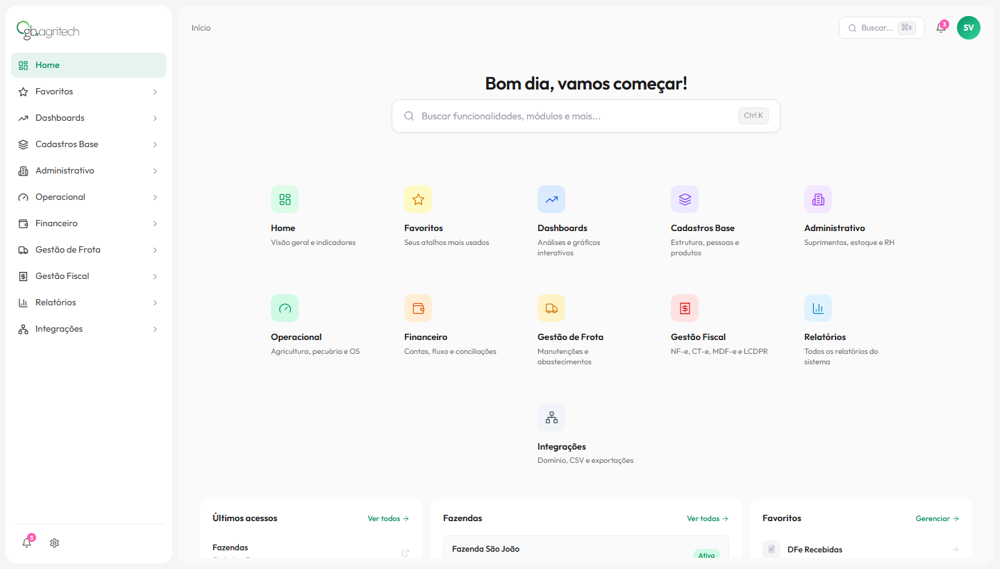

# Cerne — Redesign do Sistema de Gestão GB Agritech

> Protótipo de alta fidelidade para o redesign completo do sistema legado de gestão agrícola da **GB Agritech**.



---

## O que é o Cerne?

O **Cerne** é o novo sistema de gestão da GB Agritech — um redesign do zero do painel administrativo legado, com foco em experiência do usuário, clareza de informação e velocidade de operação no campo.

O sistema legado cumpre bem sua função, mas carrega anos de decisões acumuladas que tornam o uso mais lento e a manutenção mais custosa. O Cerne nasce para resolver isso: mesma profundidade de funcionalidades, com uma interface moderna, navegação intuitiva e código sustentável.

---

## Módulos planejados

| Módulo | Descrição |
|---|---|
| **Home** | Visão geral, acessos recentes e favoritos |
| **Dashboards** | Análises e gráficos interativos por safra |
| **Cadastros Base** | Fazendas, pessoas, produtos e estrutura |
| **Administrativo** | Suprimentos, estoque e RH |
| **Operacional** | Agricultura, pecuária e ordens de serviço |
| **Financeiro** | Contas, fluxo de caixa e conciliações |
| **Gestão de Frota** | Manutenções e abastecimentos |
| **Gestão Fiscal** | NF-e, CT-e, MDF-e e LCDPR |
| **Relatórios** | Todos os relatórios do sistema |
| **Integrações** | Domínio, CSV e exportações |

---

## Stack

- **React 18** + **TypeScript** + **Vite**
- **Lucide React** para ícones
- Estilos via **inline styles** com tokens de design consistentes
- **Storybook** para documentação e desenvolvimento isolado de componentes
- Fonte **Outfit** (Google Fonts)

---

## Componentes documentados no Storybook

```
Badge          — variantes success / danger / warning / neutral
FormField      — input com label, hint, erro e estados
FormSelect     — select customizado com as mesmas variantes
FormSection    — agrupador de campos com título e subtítulo
Stepper        — progresso multi-etapas interativo
PageHeader     — cabeçalho de página com título, contagem e ações
DataTable      — tabela genérica com estados loading e empty
Tooltip        — tooltip via portal, posicionado dinamicamente
ModuleCard     — card de módulo do dashboard home
```

---

## Storybook

A documentação de componentes está publicada no Chromatic:

**[→ Acessar Storybook no Chromatic](https://69fbb4d23569b2759aad4d30-krqwjaxare.chromatic.com/)**

Cada push para `main` requer rodar `npm run chromatic` para publicar uma nova build. O Storybook inclui suporte ao **GB Mode** (dark theme) via toolbar de tema.

---

## Rodando localmente

```bash
npm install

# App principal
npm run dev          # http://localhost:5173

# Storybook de componentes
npm run storybook    # http://localhost:6006
```

---

## Status

Este repositório contém o **protótipo funcional** do Cerne — navegação, estrutura de módulos e as primeiras telas implementadas (Fazendas, Perfil do Usuário). A implementação completa de cada módulo será feita de forma incremental.
